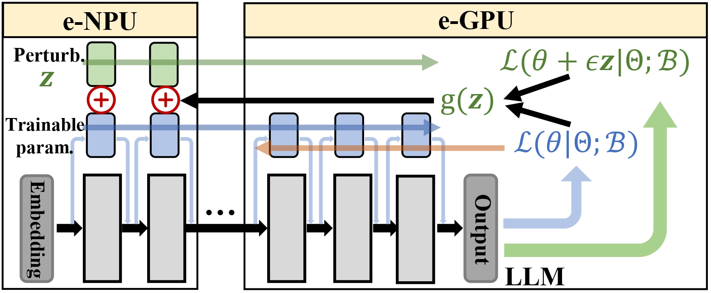
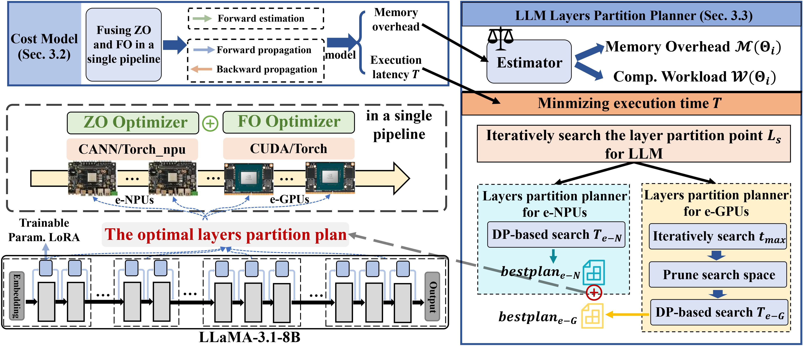

  

# EdgeSpeed

> A flexible and efficient edge computing framework for ML inference and distributed processing.

## 项目简介

**EdgeSpeed**是一个面向边缘分布式场景的开源框架，目标是在广泛异构边缘设备上提供统一的 **分布式训练、微调、推理** 能力。

框架支持多种边缘赢家架构（GPU、NPU、CPU和FPGA）以及设备形态（嵌入式设备、移动设备、工业网关等），既可以在本地完成高效推理，也可以与云端协同工作，从而显著提升边缘设备的智能化水平和资源利用效率。

EdgeSpeed 在设计上重点关注：

- **性能优化**：低延迟、高吞吐，充分利用硬件加速能力  
- **易用性**：统一 API、模块化设计、开箱即用的示例  
- **安全性**：数据不出本地、支持隐私计算与安全通信  

---

## 核心特性

- 🧩 **跨平台支持**  
  支持多种边缘设备和操作系统，包括：  
  - Linux（x86 / ARM）  
  - Android  
  - 定制嵌入式系统等

- ⚡ **高效推理引擎**  
  - 集成多种主流机器学习框架：**PyTorch**、**Torch_npu** 等  
  - 支持自定义模型格式和推理后端  
  - 针对边缘场景进行算子融合、内存复用等优化

- 🪶 **轻量级与低延迟**  
  - 支持模型量化（INT8 / FP16 等）与剪枝  
  - 支持 GPU、NPU、CPU和FPGA 等多种硬件加速  
  - 面向多种分布式边缘场景（如岩土检测、空地协同）进行了延迟优化

- 🤝 **边缘协同计算**  
  - 支持多个边缘节点之间的协同推理与任务分发  
  - 支持与云端服务协同执行复杂计算  
  - 在确保本地数据隐私的前提下，实现跨设备的数据共享与联合处理

- 🌐 **开源与社区友好**  
  - 完全开源，代码结构清晰、模块边界明确  
  - 欢迎通过 Issue / PR 提交反馈和贡献  
  - 支持二次开发与定制集成

---

## 目录

- [项目简介](#项目简介)  
- [核心特性](#核心特性)  
- [架构概览](#架构概览)  
- [安装](#安装)  
  - [环境要求](#环境要求)  
  - [通过 pip 安装](#通过-pip-安装-示例)  
  - [从源码构建](#从源码构建-示例)  
- [快速开始](#快速开始)  
- [典型应用场景](#典型应用场景)  
- [路线图 Roadmap](#路线图-roadmap)  
- [参与贡献](#参与贡献)  
- [许可证](#许可证)

---

## 架构概览

> ⚠️ 还不确定，可以找一些论文里的能描述结构的图来描述

  

  

Edge Framework 采用模块化架构，大致可分为以下几个子系统：

1. **设备抽象层（Device Abstraction）**：屏蔽不同硬件平台差异，提供统一的设备接口  
2. **推理引擎层（Inference Engine）**：封装多种推理后端和模型格式  
3. **数据管线层（Data Pipeline）**：负责数据读写、预处理与后处理  
4. **协同调度层（Collaborative Scheduler）**：负责任务在边缘节点与云之间的调度与协同  
5. **管理与监控（Management & Monitoring）**：日志、指标上报、远程配置等

---

## 安装

### 环境要求

- **Python**：`>= 3.10`  
- **操作系统**：  
  - Linux  
  - macOS  
  - Windows  
- **硬件要求（可选但推荐）**：  
  - 支持 CUDA 的 GPU  
  - 各种NPU、CPU硬件

根据你的实际依赖，还可以在这里列出：

- CMake / GCC / Clang 版本要求  
- 需要安装的系统库（如 `libopencv` 等）
